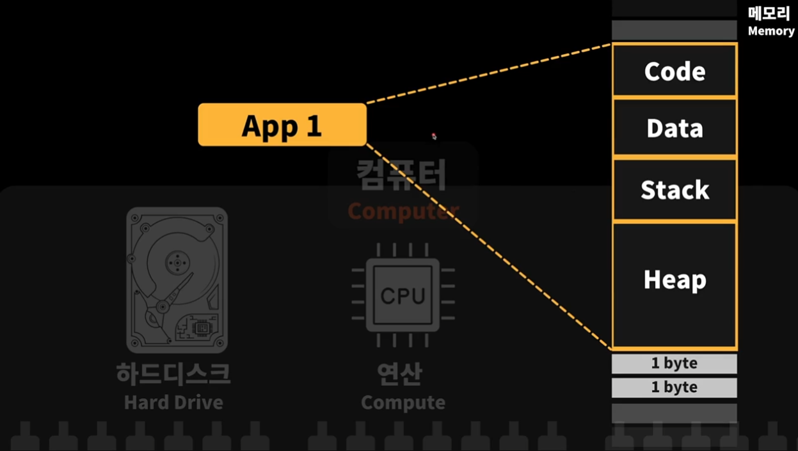
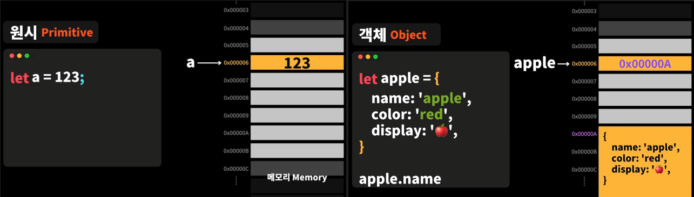
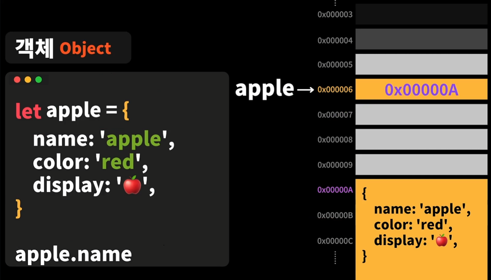
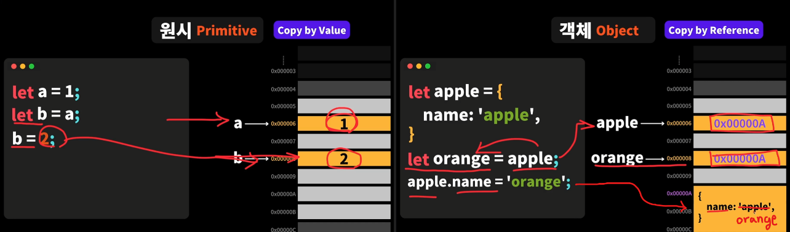

# 변수(Variable)
- 값을 저장하는 공간

- 자료를 저장할 수 있는 **이름이 주어진 기억 장소**

- 변수에 값을 할당하여 선언하면 메모리 어딘가의 주소에 값이 저장된다.

- `let`
  - 재할당 가능

- `const`
  - 재할당 불가능
  - 상수, 상수 변수 또는 변수 `상수 : 변수의 값이 절대 변하지 않는다.`

- `var`


<br />
<br />


## 변수 이름 짓는법
- 저장된 값을 잘 나타낼 수 있는 의미있는 이름

- 이름이 구체적일수록 좋다.

- 변수 규칙
  - 라틴문자(0-9, a-z, A-Z), _(underscore)
  - 대소문자를 구분한다.
  - 추천 : `recommendedName` - Camel Case 방식
  - 여러개의 변수를 숫자로 구분 ❌ (최대한 의미있고 구체적인 이름으로 작성)
  - 한국어 ❌
  - 숫자로 시작 ❌
  - 특수문자 ❌ (_, $ 두가지는 예외)
  - [예약어](https://developer.mozilla.org/en-US/docs/Web/JavaScript/Reference/Lexical_grammar#keywords) ❌

```javascript
// 나쁜 예제
let number = 30;
let audio1; // 여러개의 변수를 숫자로 구분 ❌
let audio2; // 여러개의 변수를 숫자로 구분 ❌

// 좋은 예제
let myAge = 30;
let backgroundAudio; // 최대한 의미있고 구체적인 이름으로 작성
let windAudio; // 최대한 의미있고 구체적인 이름으로 작성

// 꿀팁
// 구체적인 부분을 뒤로 빼주면 나중에 관련 변수들을 찾을 때 용이하다.
let audioBackground;
let audioWind;
```


<br />
<br />


# 메모리
- 하드디스크에서 데이터를 읽고 쓰는것은 오래걸린다.
  - 데이터를 빠르게 읽고 쓰기 위해서 메모리에 보관해두고 사용한다.

- 1 byte의 저장 공간을 갖는 메모리 셀들이 연속으로 이루어져 있다.
  - 1 byte = 8 bit
  - bit = 0또는 1을 담을 수 있는 정보 단위

- APP 을 여러개 열게 되면 APP 마다 필요한 메모리가 할당이 된다.
  - 여러개의 APP 을 사용하거나 APP 을 사용하는데 여러 문서 작업들을 동시에 하다보면 메모리가 부족해져 제대로 동작하지 않을 수 있다.

- APP 이 메모리에 올라왔을 때 구성
  - Code
    - 코드가 저장되는 영역
  - Data
    - 전역, 정적 변수가 저장되는 영역
  - Stack
    - 함수의 호출과 관계되는 지역, 매개 변수가 저장되는 영역
  - Heap
    - 객체(복잡한 여러가지의 데이터를 함께 묶어 놓은 타입)가 할당이 되는 영역

<br />




<br />
<br />


# 변수와 메모리
- 변수의 이름은 메모리셀의 주소를 가르킨다.

- 변수의 값은 메모리셀에 저장된다.

- 원시(Primitive) 타입은 `Data`, `Stack` 에 저장된다.

- 객체(Object) 타입은 `Heap`에 저장된다.

<br />




<br />
<br />


# 데이터 타입(Data Type)
- 원시(Primitive) - 단일 데이터
  - number
  - string
  - boolean
  - null
  - undefined
  - Symbol

- 객체(Object) - 복합 데이터
  - object
  - function
  - 단일 데이터를 제외한 모든 타입


<br />
<br />


## 숫자 타입(number)
```javascript
let integer = 126; // 정수
let negative = -126; // 음수
let double = 1.26; // 실수

let binary = 0b1111011; // 2진수
let octal = 0o173; // 8진수
let hex = 0x7b; // 16진수

console.log(0 / 123); // 0
console.log(123 / 0); // Infinity
console.log(123 / -0); // -Infinity
console.log(123 / 'text'); // NaN(Not a Number)
```


<br />
<br />


## 문자열 타입(String)
```javascript
let string = '안녕하세요';
string = `안녕!` // Backtick(``) 사용 가능

// 특수 문자 출력하는법
string = "'안녕!'";
string = '"안녕!"';

// 이스케이프 표현
// https://developer.mozilla.org/ko/docs/Web/JavaScript/Reference/Global_Objects/String
string = '안녕!\n내 이름은\t\t백이야\\\u09AC';

// 템플릿 리터럴 (Template Literal)
let id = '길동';
// ES6 이전에는 다음과 같이 작성하였다.
let greetings = "'안녕!, " + id + "👋🏻\n즐거운 하루 보내!'"
// ES6부터는 Backtick(``)을 사용하여 더 쉽게 작성할 수 있게 되었다.
greetings = `'안녕!, ${id}👋🏻
즐거운 하루 보내!'`;
```


<br />
<br />


## 불리언 타입(boolean)
```javascript
let 참 = true;
let 거짓 = false;

console.log(참); // true
console.log(거짓); // false

// 활용 예
let isFree = true;
let isActivated = false;
let isEnrolled = false;

console.log(isActivated); // false

console.clear(); // 위에 작성했던 console clear

// Falshy 거짓인 값 - false
console.log(!!0); // !! - boolean 타입으로 변환해주는 연산자
console.log(!!-0);
console.log(!!'');
console.log(!!null);
console.log(!!undefined);
console.log(!!NaN);

// Truthy 참인 값 - true
console.log(!!1);
console.log(!!-1);
console.log(!!'text');
console.log(!!{}); // object
console.log(!![]); // array
console.log(!!Infinity);
```


<br />
<br />


## null, undefined 타입
```javascript
let variable;
console.log(variable); // undefined
// 변수의 값이 할당되지 않아 정해지지 않은 상태
// 메모리에는 존재하지만 값이 존재하지 않는다.

variable = null;
console.log(variable); // null
// 변수의 값이 명시적으로 없다고 할당된 상태
// 메모리에 값이 없는 상태(null)로 값이 존재한다.
```


<br />
<br />


## 객체 타입(object)
- 연관된 단일 데이터들을 그룹지어서 함께 보관할 수 있다.

- 객체의 변수 값은 메모리의 Heap 영역에 데이터들이 저장되어 그 저장된 주소를 참조값으로 가진다.

- 함수(function)도 그룹지어서 보관할 수 있다.

```javascript
let appleName = '사과'; // 사과
let appleColor = 'red'; // red
let appleDisplay = '🍎'; // 🍎

let apple = {
  name: '사과',
  color: 'red',
  display: '🍎',
};

console.log(apple); // { name: '사과', color: 'red', display: '🍎' }
console.log(apple.name); // 사과
console.log(apple.color); // red
console.log(apple.display); // 🍎

let orange = {
  name: '오렌지',
  color: 'orange',
  display: '🍊',
};

console.log(orange); // { name: '오렌지', color: 'orange', display: '🍊' }

```

<br />




<br />
<br />


## 값과 참조의 차이⭐️⭐️⭐️
- 원시(Primitive)
  - Copy by Value

```javascript
// 원시 타입은 값이 복사되어 전달 된다.
let a = 1;
let b = a; // 1
b = 2;

console.log(a); // 1
console.log(b); // 2
```

- 객체(Object)
  - Copy by Reference

```javascript
// 객체 타입은 참조값(메모리 주소, Reference)이 복사되어 전달 된다.
let apple = {
  name: '사과',
};
let orange = apple; // { name: '사과' }
orange.name = '오렌지';

console.log(apple); // { name: '오렌지' }
console.log(orange); // { name: '오렌지' }
// 동일한 object를 가르키고 있으므로 한 곳에서만 수정을 해도 동일한 값이 출력이 된다.
```
<br />




<br />
<br />


## 상수 변수 const
```javascript
const text = 'Hello';
// text = 'Hi'; - 재할당 불가능

console.log(text);

// 1. 상수
const MAX_FRUIT = 5;
// 상수를 사용할때는 변수를 항상 대문자, 단어와 단어 사이에는 underscore 분리

// 2. 재할당 불가능한 상수 변수 또는 변수
const apple = {
  name: '사과',
  color: 'red',
  display: '🍎',
};
// apple = {}; - object 자체를 재할당하는 것은 불가능

console.log(apple); // { name: '사과', color: 'red', display: '🍎' }

apple.name = '초록사과';
apple.color = 'green';
apple.display = '🍏';

console.log(apple); // { name: '초록사과', color: 'green', display: '🍏' }
// 객체의 변수 값은 메모리의 Heap 영역에 데이터들이 저장되어 그 저장된 주소를 참조값으로 가진다.
// 그래서 객체 자체가 아닌 참조값을 통한 Heap 영역의 데이터를 수정하는 것이므로 수정이 가능하다!
```


<br />
<br />


## typeof
- 데이터 타입을 확인해 준다.

- 값을 타입 문자열로 반환해 준다.

```javascript
let variable;
console.log(typeof variable); // undefined

variable = '';
console.log(typeof variable); // string

variable = 123;
console.log(typeof variable); // number

variable = {};
console.log(typeof variable); // object

variable = function () {};
console.log(typeof variable); // function

variable = Symbol();
console.log(typeof variable); // symbol 
```

- 컴파일 시에 변수의 타입이 결정되는 언어는 정적 타입이다.

- 런타임 시 자료형이 결정되는 언어는 동적 타입이다.

- 자바스크립트에도 타입이 있다.
  - 자바스크립트는 `Dynamic`, `Weakly Typed` 프로그래밍 언어이다.
    - `동적으로 결정`되고, `할당된 값에 따라서 타입이 다르게 결정`된다.