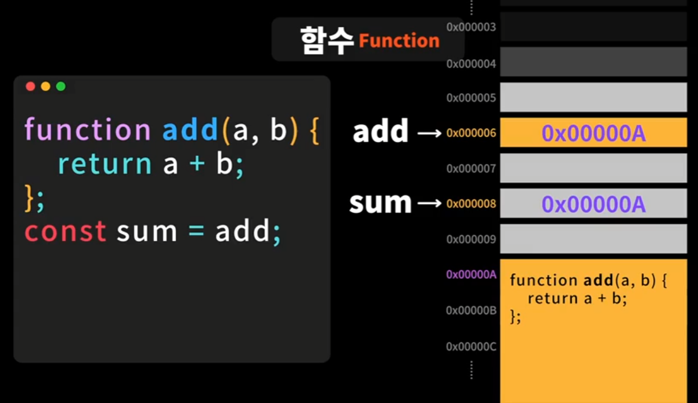

# 함수(Function)
- 특정한 일을 수행하는 코드의 집합

- 함수 단위로 작은 단위의 일들을 묶어서 사용한다.

- 함수 이름, 매개변수 이름도 의미있게 잘 지어야 한다.

- `재사용 가능`, `높은 가독성`, `유지보수성`

```javascript
// 함수 정의
function add(a, b) { // 함수이름(매개변수, 매개변수) // 매개변수 = parameter
  return a + b;
}
// 함수 호출
add(1, 2); // 함수이름(인자, 인자) // 인수 = 인자 = argument


// 사용 예제 - 1
function add(a, b) {
  // const result = a + b;
  // return result;

  // 바로 반환하는 경우라면 변수를 굳이 할당하지 않아도 된다.
  return a + b;
}
const result = add(1, 2);
console.log(result);


// 사용 예제 - 2
// 반복적인 코드가 있으면 수정, 추가 등 반복적으로 작업을 해줘야하기 때문에 함수로 만들어 사용하는것이 좋다.
function fullName(lastName, firstName) {
  return `${firstName} ${lastName} 👍`;
}

let lastName = '신';
let firstName = '짱구';
// let fullName = `${firstName} ${lastName}`
console.log(fullName(firstName, lastName));

let lastName2 = '흰';
let firstName2 = '둥이';
// let fullName2 = `${firstName2} ${lastName2}`
console.log(fullName(firstName2, lastName2));
```

<br />
<br />


## 함수와 메모리
- 함수의 데이터 타입은 객체(object) 타입이다.

- 메모리에서 함수의 이름은 함수의 메모리 주소를 참조하고 있다.

```javascript
function add(a, b) {
  return a + b;
}

const sum = add; // add 함수가 저장된 메모리 주소값을 참조하고 있다.

console.log(add(1, 2)); // 3
console.log(sum(1, 2)); // 3
```




<br />
<br />


## 반환이란?
```javascript
function add(a, b) {
  return a + b;
}
const result = add(1, 2);
console.log(result); // 3

// return을 명시적으로 하지 않으면 자바스크립트 엔진에 의해 자동으로 undefined가 반환된다.
function add2(a, b) {
  // return a + b;
  return undefined; // 자바스크립트 엔진에 의해 자동으로 처리, return; 생략 버전으로 사용 가능
}
const result2 = add2(1, 2);
console.log(result2); // undefined


// 함수에서 값을 반환해야하는 함수가 아니라면 굳이 return undefined를 작성하지 않아도 된다.
// 단순히 무언가를 프린트하는 함수라면, 즉, 특정한 일을 수행하고 아무것도 반환하지 않는 함수라면 return을 생략할 수 있다.
function print(text) {
  console.log(text);
}
print('text'); // text

function print(text) {
  console.log(text);
}
const outcome = print('text'); // text, 특정한 일을 수행하고 아무것도 반환하지 않는 함수라서 리턴값을 받는 코드를 작성할 필요는 없다.
console.log(outcome); // undefined, 아무런 값도 리턴하지 않는 함수이기때문에 리턴값을 출력하는건 의미가 없다.


// return을 함수 중간에 하게 되면 함수가 종료된다.
// 사용예 : 조건이 맞지 않는 경우 함수 도입부분에서 함수를 일찍이 종료한다!
function print(num) {
  if (num < 0) {
    return;
  }
  console.log(num);
}
print(12); // 12
print(-12); // 함수가 종료되어 출력 X
print(12); // 12
```


<br />
<br />


## 함수의 인자
```javascript
// 매개변수의 기본값은 무조건 undefined
// 매개변수의 정보는 함수 내부에서 접근이 가능한 arguments 객체에 저장된다.
function add(a, b) {
  console.log(a);
  console.log(b);
  console.log(arguments) // { '0': 1, '1': 2, '2': 3 } // 인자('0', '1', '2')에 전달되는 값을 확인할 수 있다.
  console.log(arguments[0]); // 첫 번째 인자의 값 a = 1
  return a + b;
}
add(); // a = undefined, b = undefined
add(1, 2); // a = 1, b = 2
add(1, 2, 3); //  a = 1, b = 2 // 필요한 값만 인자로 들어가고 나머지는 무시된다.


// 매개변수 기본값 Default Parameters
// undefined일 경우에만 기본값을 사용한다.
function add(a = 1, b = 1) { // 인자에 기본값을 설정할 수 있다.
  console.log(a);
  console.log(b);
  
  return a + b;
}
add(); // a = 1, b = 1
add(2, 2); // a = 2, b = 2


// Rest 매개변수 Rest Parameters 
// 얼마나 많은 갯수의 인자가 전달될건지 모를때 모든것들을 다 배열로 받고 싶을때 사용한다.
function sum(...numbers) {
  console.log(numbers);
}
sum(1, 2, 3, 4, 5, 6, 7, 8); // [ 1, 2, 3, 4, 5, 6, 7, 8 ] - 배열 표기

function sum(a, b, ...numbers) {
  console.log(a);
  console.log(b);
  console.log(numbers);
}
sum(1, 2, 3, 4, 5, 6, 7, 8); // a = 1, b = 2, [ 3, 4, 5, 6, 7, 8 ]
```