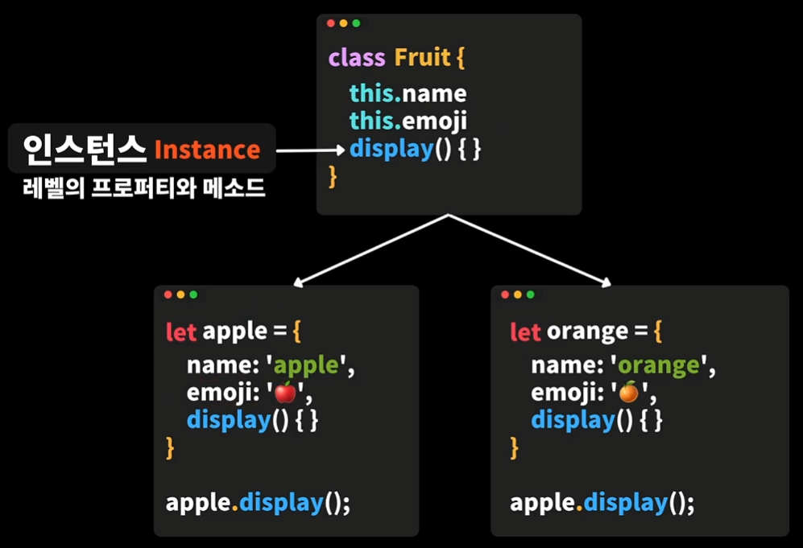
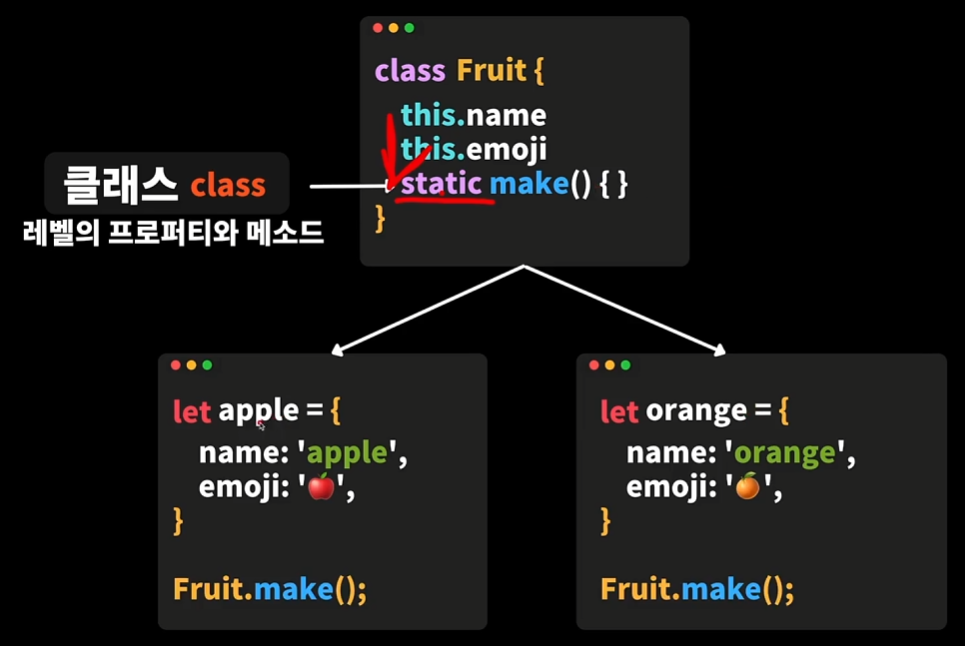

# 클래스(Class)
- 생성자 함수와 마찬가지로 객체를 생성할 수 있는 템플릿(양식)

- 생성자 함수나 클래스를 이용해 객체지향 프로그래밍을 할 수 있다.
  - 요즘 모던한 자바스크립트에서는 생성자 함수는 잘 사용하지 않는다.

- 자바스크립트 언어는 프로토타입(Prototype)을 베이스로 하지만, `ES6`부터는 클래스(Class)를 기반으로 해서 객체지향 프로그래밍을  해나갈 수 있다.

- 다른 객체지향 프로그래밍 언어에서도 많이 쓰이는 개념이다.

- 클래스에 의해서 만들어진 객체를 인스턴스(Instance)라고 한다.


<br />
<br />


## 객체를 손쉽게 만들 수 있는 템플릿
1. 생성자 함수 (오래된 고전적인 방법)

2. 클래스 ⭐️⭐️⭐️
```javascript
  class Fruit {
    // 생성자 : new 키워드로 객체를 생성할때 호출되는 함수
    constructor(name, emoji) { // 인자를 받는다.
      this.name = name;
      this.emoji = emoji;
    }

    display = () => {
      console.log(`${this.name}: ${this.emoji}`);
    }
  }

  // apple, orange는 Fruit 클래스의 인스턴스이다.
  const apple = new Fruit('apple', '🍎');
  const orange = new Fruit('orange', '🍊');

  console.log(apple); // Fruit { display: [Function: display], name: 'apple', emoji: '🍎' }
  console.log(orange); // Fruit { display: [Function: display], name: 'orange', emoji: '🍊' }
  console.log(apple.name); //apple
  console.log(apple.emoji); // 🍎
  apple.display(); // apple: 🍎
```


<br />
<br />


## 재사용성을 높이는 방법
- 인스턴스 레벨의 프로퍼티와 메서드
  - 클래스를 이용해 중복적으로 여러개의 인스턴스를 찍어낼 수 있는 인스턴스 레벨의 프로퍼티와 메서드
  - 클래스를 이용해 필요한 데이터를 주입해서 동일한 인스턴스를 여러개 찍어낼 수 있다.
  - 이 때 동일한 프로퍼티와 메서드가 들어가기 때문에 인스턴스 레벨의 프로퍼티와 메서드로 볼 수 있다.



<br />

- 클래스 레벨의 프로퍼티와 메서드
  - 모든 객체마다 동일하게 참조해야하는 프로퍼티와 메서드가 있다면?
  - 클래스(class)레벨의 프로퍼티와 메서드를 이용한면된다.
  - static이 붙은 프로퍼티와 메서드는 만들어진 인스턴스에 포함되지 않고 클래스에 그대로 남는다.
  - 클래스에 한번만 정의하고 재사용할 수 있다.



<br />

```javascript
class Fruit {
  static MAX_FRUITS = 4;

  constructor(name, emoji) {
    this.name = name;
    this.emoji = emoji;
  }

  // 만들어진 오브젝트의 데이터에 접근해서 무언가를 출력해야한다.
  // 즉, 만들어진 인스턴스와 밀접하게 연관이 되어있기 때문에 이 부분은 그대로 인스턴스 레벨로 두는게 좋다.
  display = () => {
    console.log(`${this.name}: ${this.emoji}`);
  }

  // 클래스 레벨의 메서드
  static makeRandomFruit() {
    // 클래스 레벨의 메서드에서는 this를 참조할 수 없다.
    // 클래스 자체로는 아무것도 채워지지않은 템플릿이기 때문이다.
    return new Fruit('banana', '🍌');
  }
  // 클래스별로 공통적으로 사용할 수 있고, 만들어진 인스턴스에 참조할 필요가 없는 함수라면 클래스 레벨로 만들 수 있다.
}

// 클래스 자체에는 데이터가 들어있지 않은 템플릿 형식이기때문에 오류가 발생한다.
// console.log(Fruit.name);
// Fruit.display();

// 클래스 레벨의 메소드 호출
const banana = Fruit.makeRandomFruit();
console.log(banana); // Fruit { display: [Function: display], name: 'banana', emoji: '🍌' }
console.log(Fruit.MAX_FRUITS); // 4


// 인스턴스의 프로퍼티와 메서드는 꼭 생성된 인스턴스를 통해서 접근하고 호출해야한다.
const apple = new Fruit('apple', '🍎');
const orange = new Fruit('orange', '🍊');

console.log(apple); // Fruit { display: [Function: display], name: 'apple', emoji: '🍎' }
console.log(orange); // Fruit { display: [Function: display], name: 'orange', emoji: '🍊' }
console.log(apple.name); //apple
console.log(apple.emoji); // 🍎
apple.display(); // apple: 🍎
```


<br />
<br />


## 필드(Field)
```javascript
// 접근 제어자 - 캡슐화 // 외부에서는 변경이 불가능하게 만들어 준다.
// private(외부에서 볼수 없고 접근이 불가능), public(외부에서 볼수 있고 접근이 가능), protected(상속된 자식클래스에서만 접근이 가능)
// 다른 언어에서는 private, public, protected 키워드로 접근제어를 컨트롤 할 수 있지만, 자바스크립트에서는 이런 키워드가 없다.
// private(#), public(기본), protected
class Fruit {
  // name; // field, constructor에서 주어지는 데이터라면 생략 가능
  // emoji; // field
  #name; // private field
  #emoji; // private field
  #type = '과일'; // 인스턴스를 만들때 초기화가 필요할 때 초기화 해줄 수 있다.
  constructor (name, emoji) {
    this.#name = name;
    this.#emoji = emoji;
  }

  #display = () => {
    console.log(`${this.#name}: ${this.#emoji}`);
  }
}

const apple = new Fruit('apple', '🍎');

console.log(apple); // Fruit {} - private(외부에서 볼수 없고 접근이 불가능)

// apple.#display();
// SyntaxError: Private field '#display' must be declared in an enclosing class
// 비공개 필드인 이름은 클레스 내부에서만 선언이 되어야한다.
```


<br />
<br />


## 게터(Getter)와 세터(Setter)
```javascript
class Student {
  constructor (firstName, lastName) {
    this.firstName = firstName;
    this.lastName = lastName;
    // this.fullName = `${this.lastName}${this.firstName}`;
    // 외부에서 변경된 이름을 선언해도 이미 생성자 안에서 풀네임이 지정되어 업데이트 되지 않는다.
  }

  // 접근자 프로퍼티(Accessor property)
  // 접근을 할 때 호출이 된다.
  // 단순히 속성의 한 부분이라고 간주되는 것들을 함수로 만들어야할 때 get을 사용하여 프로퍼티를 호출하듯이 호출할 수 있다.
  get fullName() {
    return `${this.lastName}${this.firstName}`
  }

  // 할당을 할 때 호출이 된다.
  set fullName(value) {
    console.log(value);
  }
}

const student = new Student('짱아', '신');
student.firstName = '짱구';
console.log(student.firstName); // 짱구, 프로퍼티 호출
console.log(student.fullName); // 신짱구, 함수 호출, 접근(get 호출)
student.fullName = '흰둥이'; // 흰둥이, 할당(set 호출)
```


<br />
<br />


## 상속의 관계
```javascript
// 동물물, 부모
class Animal {
  constructor (color) {
    this.color = color;
  }

  eat() {
    console.log('먹자~!');
  }

  sleep() {
    console.log('자자~');
  }
}


// 호랑이, 자식
// 추가적으로 필요한게 없는 경우
class Tiger extends Animal {}

const tiger = new Tiger('노랑이');
console.log(tiger); // Tiger { color: '노랑이' }
tiger.eat(); // 먹자~!
tiger.sleep(); // 자자~


// 강아지, 자식
// 추가적으로 필요한게 있는 경우
class Dog extends Animal {
  constructor (color, ownerName) { // 추가적으로 필요한 데이터를 추가할 땐 부모의 데이터도 받아와야 한다.
    super(color); // super()은 상속하고 있는 부모를 가르킨다.
    this.ownerName = ownerName;
  }

  // 오버라이딩(overriding)
  // 부모 클래스에 있는 함수를 덮어 씌운다.
  eat() {
    console.log('먹는다~!');
  }

  // 부모의 기능을 기대로 유지하면서 추가적인걸 하고 싶을 때
  eat() {
    super.eat();
    console.log('또 먹자~!');
  }

  // 강아지에게만 있는 함수
  play() {
    console.log('놀자아~!');
  }
}

const dog = new Dog('흰둥이', '신짱구');
console.log(dog); // Dog { color: '흰둥이', ownerName: '신짱구' }
dog.eat(); // 먹자~!, 또 먹자~!
dog.sleep(); // 자자~
dog.play(); // 놀자아~!
```